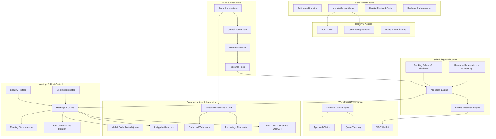

# Zoom Pool Manager (ZPM) — Architecture Document (Milestone M0.5)

> **Document Status:** Complete (M0.5 Deliverable)  
> **Source Documents:** [`CLAUDE.md`](../CLAUDE.md), [`docs/SPEC.md`](SPEC.md), [`docs/zoom-verification.md`](zoom-verification.md)

---

## 1. System Overview & Core Philosophy

**Zoom Pool Manager (ZPM)** is an independent, single-organization Laravel 12 application designed to pool licensed Zoom accounts and automatically assign them to meetings without exposing host credentials.

### Key Architectural Principles
1. **Zero Fake Behavior & No Stubs:** Features are implemented end-to-end (database migration, model, domain service, policy, controller, view, queued job, test, and documentation).
2. **Strict Single Organization:** Multi-tenancy is completely absent. No `organization_id` or `tenant_id` columns exist on any business tables.
3. **Domain-Driven Design (DDD):** Business logic resides strictly in `app/Domain/<Module>`. Controllers validate requests, authorize via policies, delegate to domain services, and return responses.
4. **Asynchronous Operations:** All slow or external operations (Zoom API calls, SSO sync, emails, webhooks) are dispatched to background queue workers. Normal HTTP requests never block on external systems.
5. **Shared Hosting and Docker First:** Production deployments require zero Node.js runtime. Releases are distributed as standalone ZIPs with compiled assets, vendor dependencies, and configuration to place `.env` safely outside the web root.

---

## 2. Module Dependency Graph

Each module is structured under `app/Domain/<Module>` with its own Services, Actions, Models, Policies, Jobs, Events, and DTOs.



---

## 3. Provider Interfaces

To maintain strict modularity, core domain logic interacts with external systems exclusively through provider interfaces located in `app/Domain/<Module>/Contracts/`.

### 3.1 IdentityProvider
```php
namespace App\Domain\Auth\Contracts;

interface IdentityProvider
{
    public function getAuthUrl(string $state): string;
    public function handleCallback(string $code): ExternalUserDTO;
    public function parseMetadata(string $metadataXml): IdpMetadataDTO;
}
```
*Implementations:* `GoogleIdentityProvider`, `MicrosoftIdentityProvider`, `SamlIdentityProvider`.

### 3.2 MeetingProvider
```php
namespace App\Domain\Meetings\Contracts;

interface MeetingProvider
{
    public function createMeeting(MeetingDTO $dto): RemoteMeetingDTO;
    public function updateMeeting(string $remoteMeetingId, MeetingDTO $dto): RemoteMeetingDTO;
    public function deleteMeeting(string $remoteMeetingId): void;
    public function getMeeting(string $remoteMeetingId): RemoteMeetingDTO;
    public function getFreshStartUrl(string $remoteMeetingId): string;
    public function rotateHostKey(string $remoteUserId): string;
}
```
*Implementations:* `ZoomMeetingProvider` (V1.0/V1.1), `FakeMeetingProvider` (Demo mode).

### 3.3 MailProvider
```php
namespace App\Domain\Mail\Contracts;

interface MailProvider
{
    public function send(EmailMessageDTO $message): EmailDeliveryReceiptDTO;
    public function testConnection(): ConnectionTestResultDTO;
}
```
*Implementations:* `SmtpMailProvider`, `GmailApiMailProvider`, `MicrosoftGraphMailProvider`.

### 3.4 StorageProvider
```php
namespace App\Domain\Storage\Contracts;

interface StorageProvider
{
    public function getRecordingShareUrl(string $remoteFileId): string;
    public function getStorageUsage(): StorageUsageDTO;
}
```
*Implementations:* `ZoomCloudStorage` (V1.0), `LocalStorage`, `S3Storage`, `R2Storage` (V1.1).

---

## 4. Configuration Precedence (`EffectivePolicyResolver`)

Meeting creation, security configurations, and parameter validation strictly adhere to the hierarchical precedence chain:

```
┌────────────────────────────────────────────────────────┐
│ Organization Policy (System Settings)                  │  <-- Highest (Cannot be loosened)
└───────────────────────────┬────────────────────────────┘
                            │
┌───────────────────────────▼────────────────────────────┐
│ Security Profile (e.g., Exam, Confidential)            │
└───────────────────────────┬────────────────────────────┘
                            │
┌───────────────────────────▼────────────────────────────┐
│ Department Policy                                      │
└───────────────────────────┬────────────────────────────┘
                            │
┌───────────────────────────▼────────────────────────────┐
│ User Role Policy                                       │
└───────────────────────────┬────────────────────────────┘
                            │
┌───────────────────────────▼────────────────────────────┐
│ Meeting Template (Defaults)                            │
└───────────────────────────┬────────────────────────────┘
                            │
┌───────────────────────────▼────────────────────────────┐
│ User Request (Overrides within allowed bounds)         │  <-- Lowest
└────────────────────────────────────────────────────────┘
```

The `EffectivePolicyResolver` resolves settings such as passcodes, waiting rooms, join before host, recording modes, AI companion policy, max duration, and participant caps. Higher levels always override lower levels; lower levels can only apply stricter restrictions.

---

## 5. Queue, Scheduler & Pseudo-Cron Architecture

### 5.1 Database Queue with `SKIP LOCKED`
To avoid dependencies on external services like Redis or RabbitMQ:
- The standard Laravel database queue driver is utilized with MySQL 8.0+ or MariaDB 10.6+.
- Concurrent workers pull jobs using `FOR UPDATE SKIP LOCKED` natively supported by Laravel.
- Jobs are prioritized into queues: `high` (immediate host launch, approvals), `default` (meeting provisioning, calendar updates), `low` (syncs, reports, drift reconciliation).

### 5.2 Cron Scheduling on Shared Hosting
On standard shared hosting without root access:
- CLI cron runs every 5–15 minutes:
  ```bash
  * * * * * php /path/to/artisan schedule:run >> /dev/null 2>&1
  ```
- The queue worker is invoked via the scheduler:
  ```php
  $schedule->command('queue:work --stop-when-empty --max-time=50')
      ->withoutOverlapping();
  ```
- **Pseudo-Cron Endpoint:** For environments without CLI crontab access, an authenticated HTTP endpoint `POST /cron/{token}` executes scheduled tasks with IP allow-listing, rate-limiting, and atomic locking against overlapping runs.

---

## 6. Security, Identity & Break-Glass Architecture

### 6.1 Identity Model Separation
The system strictly enforces separation between application users and Zoom resources:

| Role/Concept | Database Column | Explanation |
|---|---|---|
| **Requester** | `meetings.requester_user_id` | The application user who submitted the booking request. |
| **Meeting Owner** | `meetings.owner_user_id` | The faculty or staff member for whom the meeting is scheduled. |
| **Allocated Resource** | `meetings.zoom_resource_id` | The managed pool resource assigned to fulfill the booking. |
| **Zoom Host Account** | `zoom_resources.zoom_user_id` | The technical Zoom account hosting the meeting. |
| **Recording Owner** | `recordings.logical_owner_user_id`| Logical owner with access rights to playback/download. |
| **Approver** | `meeting_approvals.approver_user_id` | The user who approved the meeting allocation. |

*A pooled Zoom user is strictly a resource, never an application login.*

### 6.2 Break-Glass Emergency Access
- Local Super Administrator accounts require **mandatory TOTP enrollment** (RFC 6238) and 10 single-use hashed recovery codes.
- Local admin password reset is strictly disabled in the UI; reset is only possible via CLI:
  ```bash
  php artisan zpm:admin:reset {email}
  ```
- Emergency IT overrides require a mandatory reason, generate a record in `overrides`, dispatch an immediate notification to the meeting owner, and log an entry in the immutable audit trail.

### 6.3 Immutable Audit Logging
- Table `audit_logs` has no model update or delete methods (`saving` and `deleting` model events throw an exception).
- Tamper detection is maintained through cryptographic hashing:
  $$\text{hash} = \text{SHA-256}(\text{previous\_hash} + \text{row\_json})$$
- Purging is restricted to scheduled data retention jobs and is itself recorded in the audit log.

---

## 7. Deployment Models

### 7.1 Shared Hosting (cPanel, Plesk, DirectAdmin)
- GitHub Actions pipeline packages a zero-dependency ZIP archive containing pre-compiled assets (`public/build`) and optimized vendor libraries.
- Only the `public/` directory resides in the document root (`public_html`).
- The `.env` file and application root are placed outside the web root, loaded via `$app->useEnvironmentPath()` configured in `bootstrap/app.php` and `zpm-paths.php`.
- The installer performs an HTTP self-test to verify that `.env`, `vendor/`, and `storage/` are not web-accessible; the installation cannot complete if exposure is detected.

### 7.2 Docker Compose (Development & Container Production)
- Standardized container setup:
  - `app`: PHP 8.3-FPM with required extensions (`bcmath`, `ctype`, `curl`, `dom`, `fileinfo`, `filter`, `json`, `mbstring`, `openssl`, `pcre`, `pdo_mysql`, `session`, `tokenizer`, `xml`, `gmp`).
  - `web`: Nginx or Caddy serving static assets and proxying requests to PHP-FPM.
  - `db`: MariaDB 10.6 or MySQL 8.0.
  - `queue`: Worker container running `queue:work` in background.
  - `scheduler`: Lightweight cron daemon invoking `schedule:run`.

---

## 8. Version Scope Matrix

| Feature | V1.0 (Core Release) | V1.1 (Enhancement) | V2 (Future Roadmap) |
|---|---|---|---|
| **Zoom Allocation** | Single/Split/Per-occurrence pool allocation | Automated attendance tracking | Multi-meeting provider (Teams/Meet) |
| **Recordings** | Logical ownership, share URL redirect, quota alert | Direct download, transcripts, S3/R2 storage | LMS / ERP auto-publishing |
| **Authentication** | Local + MFA, Google, Entra, SAML 2.0 | Daily admin digest, Teams alerts | SCIM 2.0 automatic deprovisioning |
| **Scheduling** | Single occurrence, recurring series, blackouts | Academic terms, timetable batch import | Multi-term curriculum scheduling |
| **API** | REST v1 with Scramble OpenAPI & API keys | Outgoing webhook filtering | GraphQL API |
