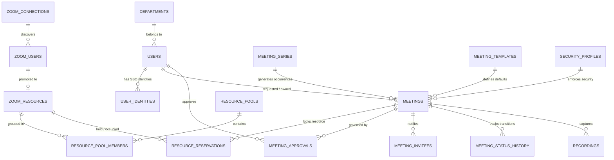

# Zoom Pool Manager (ZPM) — Database Schema & ERD (Milestone M0.5)

> **Document Status:** Complete (M0.5 Deliverable)  
> **Source Documents:** [`CLAUDE.md`](../CLAUDE.md), [`docs/SPEC.md`](SPEC.md)

---

## 1. Schema Conventions & Design Standards

1. **Identifier Standards:**
   - **Internal Primary Keys:** `id` BIGINT UNSIGNED AUTO_INCREMENT for high-performance joins, foreign keys, and clustered indexing.
   - **Public Identifiers:** `public_id` CHAR(26) storing ULIDs (Universally Unique Lexicographically Sortable Identifiers) for all external URLs, API responses, and webhooks.
2. **Timestamps & Timezones:**
   - All datetime columns are stored in UTC (`DATETIME` or `TIMESTAMP`).
   - User display times are dynamically converted using the organization or user's configured timezone.
3. **Soft Deletes:**
   - Applied to core entities: `users`, `departments`, `zoom_connections`, `zoom_resources`, `resource_pools`, `meeting_templates`, `security_profiles`, `meeting_series`, `meetings`.
4. **Single-Tenant Integrity:**
   - Absolutely **no** `tenant_id` or `organization_id` columns exist on business tables.
5. **Security & Cryptography:**
   - Sensitive credentials (OAuth client secrets, webhook tokens, passcodes, MFA secrets, host keys) are stored encrypted using Laravel's application key (`encrypted` cast).
   - API keys and MFA recovery codes are hashed using SHA-256 / Argon2id.

---

## 2. Core Entity-Relationship Diagram (ERD)

---

## 3. Detailed Table Definitions by Domain

### 3.1 Identity & Access Control

#### `departments`
Stores academic or administrative departments within the organization.
- `id` (bigint unsigned, PK, auto_increment)
- `public_id` (char(26), unique, indexed)
- `name` (varchar(100), not null)
- `code` (varchar(30), unique, not null)
- `description` (text, nullable)
- `is_active` (boolean, default true, indexed)
- `created_at`, `updated_at`, `deleted_at`

#### `users`
Central user accounts (No `role` column; roles are managed via Spatie permission tables).
- `id` (bigint unsigned, PK, auto_increment)
- `public_id` (char(26), unique, indexed)
- `department_id` (bigint unsigned, FK -> departments.id, nullable, indexed)
- `name` (varchar(150), not null)
- `email` (varchar(190), unique, not null)
- `password` (varchar(255), nullable) — *Nullable for pure SSO users*
- `timezone` (varchar(50), default 'Asia/Kolkata')
- `locale` (varchar(10), default 'en')
- `is_active` (boolean, default true, indexed)
- `mfa_enabled` (boolean, default false)
- `last_login_at` (datetime, nullable)
- `remember_token` (varchar(100), nullable)
- `created_at`, `updated_at`, `deleted_at`

#### `identity_providers`
Configured SSO providers (Google OIDC, Microsoft Entra ID, SAML 2.0).
- `id` (bigint unsigned, PK, auto_increment)
- `name` (varchar(100), not null)
- `driver` (varchar(50), not null) — *google, microsoft, saml*
- `client_id` (varchar(255), nullable)
- `client_secret` (text, encrypted, nullable)
- `tenant_id` (varchar(255), nullable)
- `metadata_url` (varchar(500), nullable)
- `metadata_xml` (mediumtext, nullable)
- `certificate_primary` (text, nullable)
- `certificate_secondary` (text, nullable)
- `allowed_domains` (json, nullable)
- `role_mapping` (json, nullable)
- `department_mapping` (json, nullable)
- `enabled` (boolean, default false, indexed)
- `created_at`, `updated_at`

#### `user_identities`
Links local users to external SSO accounts.
- `id` (bigint unsigned, PK, auto_increment)
- `user_id` (bigint unsigned, FK -> users.id, not null)
- `identity_provider_id` (bigint unsigned, FK -> identity_providers.id, not null)
- `external_id` (varchar(255), not null)
- `email` (varchar(190), not null)
- `last_authenticated_at` (datetime, nullable)
- `created_at`, `updated_at`
- *Unique Index:* `(identity_provider_id, external_id)`

#### `mfa_secrets`
Stores TOTP secrets for users with MFA enabled.
- `id` (bigint unsigned, PK, auto_increment)
- `user_id` (bigint unsigned, FK -> users.id, unique, not null)
- `secret` (text, encrypted, not null)
- `enrolled_at` (datetime, not null)
- `created_at`, `updated_at`

#### `mfa_recovery_codes`
Single-use backup recovery codes.
- `id` (bigint unsigned, PK, auto_increment)
- `user_id` (bigint unsigned, FK -> users.id, not null, indexed)
- `code_hash` (varchar(64), not null)
- `used_at` (datetime, nullable)
- `created_at`, `updated_at`

#### `api_keys`
Scoped API keys for programmatic `/api/v1` integrations.
- `id` (bigint unsigned, PK, auto_increment)
- `name` (varchar(100), not null)
- `key_prefix` (varchar(16), not null, indexed)
- `key_hash` (varchar(64), unique, not null)
- `user_id` (bigint unsigned, FK -> users.id, not null)
- `scopes` (json, not null)
- `rate_limit_per_minute` (int unsigned, default 60)
- `last_used_at` (datetime, nullable)
- `expires_at` (datetime, nullable)
- `revoked_at` (datetime, nullable)
- `created_at`, `updated_at`

---

### 3.2 Zoom Connections & Resource Pools

#### `zoom_connections`
Stores Server-to-Server OAuth credentials and connection health.
- `id` (bigint unsigned, PK, auto_increment)
- `public_id` (char(26), unique, indexed)
- `name` (varchar(100), not null)
- `account_id` (text, encrypted, not null)
- `client_id` (text, encrypted, not null)
- `client_secret` (text, encrypted, not null)
- `webhook_secret_token` (text, encrypted, nullable)
- `status` (varchar(30), default 'disconnected') — *active, degraded, error, disconnected*
- `granted_scopes` (json, nullable)
- `last_sync_at` (datetime, nullable)
- `last_success_at` (datetime, nullable)
- `last_error` (text, nullable)
- `last_error_at` (datetime, nullable)
- `enabled` (boolean, default true, indexed)
- `created_at`, `updated_at`, `deleted_at`

#### `zoom_users`
Discovered accounts under a Zoom connection.
- `id` (bigint unsigned, PK, auto_increment)
- `connection_id` (bigint unsigned, FK -> zoom_connections.id, not null)
- `zoom_user_id` (varchar(64), not null, indexed)
- `email` (varchar(190), not null)
- `first_name` (varchar(100), nullable)
- `last_name` (varchar(100), nullable)
- `user_type` (int unsigned, not null) — *1: Basic, 2: Licensed*
- `status` (varchar(30), not null) — *active, inactive, pending*
- `timezone` (varchar(50), nullable)
- `host_key` (text, encrypted, nullable)
- `synced_at` (datetime, not null)
- `raw_metadata` (json, nullable)
- `created_at`, `updated_at`
- *Unique Index:* `(connection_id, zoom_user_id)`

#### `zoom_resources`
Pooled Zoom accounts available for meeting assignment.
- `id` (bigint unsigned, PK, auto_increment)
- `public_id` (char(26), unique, indexed)
- `zoom_user_id` (bigint unsigned, FK -> zoom_users.id, unique, not null)
- `managed` (boolean, default false, indexed)
- `status` (varchar(30), default 'active') — *active, maintenance, suspended*
- `priority` (int, default 10)
- `is_backup` (boolean, default false)
- `participant_capacity` (int unsigned, default 100)
- `large_meeting_capacity` (int unsigned, default 0)
- `webinar_capacity` (int unsigned, default 0)
- `cloud_recording` (boolean, default true)
- `transcript` (boolean, default true)
- `ai_companion` (boolean, default false)
- `max_concurrent` (int unsigned, default 1)
- `capabilities_checked_at` (datetime, nullable)
- `daily_api_call_count` (int unsigned, default 0)
- `daily_api_reset_at` (datetime, nullable)
- `created_at`, `updated_at`, `deleted_at`

#### `resource_pools`
Logical groupings of Zoom resources (e.g. Standard, Emergency, Large Events).
- `id` (bigint unsigned, PK, auto_increment)
- `public_id` (char(26), unique, indexed)
- `name` (varchar(100), not null)
- `code` (varchar(50), unique, not null)
- `description` (text, nullable)
- `pool_strategy` (varchar(30), default 'least_hours_today')
- `is_emergency_pool` (boolean, default false)
- `is_active` (boolean, default true, indexed)
- `created_at`, `updated_at`, `deleted_at`

#### `resource_pool_members`
Mapping between resource pools and Zoom resources.
- `id` (bigint unsigned, PK, auto_increment)
- `pool_id` (bigint unsigned, FK -> resource_pools.id, not null)
- `resource_id` (bigint unsigned, FK -> zoom_resources.id, not null)
- `priority` (int, default 10)
- `created_at`, `updated_at`
- *Unique Index:* `(pool_id, resource_id)`

#### `resource_reservations`
**The single source of truth for resource occupancy.** Buffer times are strictly included in `occupied_until`.
- `id` (bigint unsigned, PK, auto_increment)
- `resource_id` (bigint unsigned, FK -> zoom_resources.id, not null)
- `meeting_id` (bigint unsigned, nullable, indexed)
- `source` (varchar(30), not null) — *zpm, external, maintenance*
- `occupied_from` (datetime, not null)
- `occupied_until` (datetime, not null) — *Includes buffer minutes*
- `status` (varchar(30), not null) — *held, confirmed, released*
- `hold_expires_at` (datetime, nullable)
- `created_at`, `updated_at`
- *Index for Allocation Conflict Checks:* `(resource_id, occupied_from, occupied_until, status)`

---

### 3.3 Meetings & Templates

#### `meeting_series`
Recurring meeting series definitions.
- `id` (bigint unsigned, PK, auto_increment)
- `public_id` (char(26), unique, indexed)
- `requester_user_id` (bigint unsigned, FK -> users.id, not null)
- `owner_user_id` (bigint unsigned, FK -> users.id, not null)
- `department_id` (bigint unsigned, FK -> departments.id, nullable)
- `rrule` (varchar(255), not null)
- `timezone` (varchar(50), not null)
- `start_date` (date, not null)
- `until_date` (date, nullable)
- `occurrence_count` (int unsigned, not null)
- `series_mode` (varchar(30), default 'SINGLE_RESOURCE') — *SINGLE_RESOURCE, SPLIT_WHEN_NEEDED, PER_OCCURRENCE*
- `status` (varchar(30), default 'active')
- `zoom_meeting_id` (varchar(64), nullable, indexed)
- `zoom_resource_id` (bigint unsigned, FK -> zoom_resources.id, nullable)
- `term_id` (bigint unsigned, nullable) — *V2 placeholder*
- `source` (varchar(30), default 'web')
- `created_at`, `updated_at`, `deleted_at`

#### `meetings`
**One row per meeting occurrence.** A one-off meeting has `series_id = NULL`.
- `id` (bigint unsigned, PK, auto_increment)
- `public_id` (char(26), unique, indexed)
- `series_id` (bigint unsigned, FK -> meeting_series.id, nullable, indexed)
- `occurrence_index` (int unsigned, default 1)
- `zoom_occurrence_id` (varchar(64), nullable)
- `title` (varchar(200), not null)
- `description` (text, nullable)
- `meeting_type` (varchar(50), not null) — *class, meeting, exam, webinar, interview*
- `starts_at` (datetime, not null, indexed)
- `ends_at` (datetime, not null, indexed)
- `timezone` (varchar(50), not null)
- `participant_count` (int unsigned, default 10)
- `requester_user_id` (bigint unsigned, FK -> users.id, not null, indexed)
- `owner_user_id` (bigint unsigned, FK -> users.id, not null, indexed)
- `department_id` (bigint unsigned, FK -> departments.id, nullable, indexed)
- `template_id` (bigint unsigned, nullable, indexed)
- `security_profile_id` (bigint unsigned, nullable, indexed)
- `ai_companion_policy` (varchar(20), default 'DISABLED') — *DISABLED, ALLOWED, REQUIRED*
- `recording_mode` (varchar(20), default 'none') — *none, cloud, local*
- `external_participants` (boolean, default false)
- `registration_enabled` (boolean, default false)
- `zoom_resource_id` (bigint unsigned, FK -> zoom_resources.id, nullable, indexed)
- `zoom_meeting_id` (varchar(64), nullable, indexed)
- `zoom_uuid` (varchar(64), nullable)
- `join_url` (varchar(500), nullable)
- `passcode` (text, encrypted, nullable)
- `link_distributed_at` (datetime, nullable)
- `status` (varchar(30), default 'draft', indexed)
- `idempotency_key` (varchar(64), unique, not null)
- `source` (varchar(30), default 'web') — *web, api, bulk_import, instant*
- `is_detached_from_series` (boolean, default false)
- `cancelled_reason` (text, nullable)
- `created_at`, `updated_at`, `deleted_at`

#### `meeting_templates`
Reusable booking templates with sensible defaults.
- `id` (bigint unsigned, PK, auto_increment)
- `public_id` (char(26), unique, indexed)
- `name` (varchar(100), not null)
- `code` (varchar(50), unique, not null)
- `description` (text, nullable)
- `security_profile_id` (bigint unsigned, nullable)
- `default_pool_id` (bigint unsigned, nullable)
- `default_duration_minutes` (int unsigned, default 60)
- `max_duration_minutes` (int unsigned, default 180)
- `max_participants` (int unsigned, default 100)
- `requires_approval` (boolean, default false)
- `recording_mode` (varchar(20), default 'none')
- `ai_companion_policy` (varchar(20), default 'DISABLED')
- `series_mode` (varchar(30), default 'SINGLE_RESOURCE')
- `is_active` (boolean, default true)
- `created_at`, `updated_at`, `deleted_at`

#### `security_profiles`
Validated security profile configurations.
- `id` (bigint unsigned, PK, auto_increment)
- `public_id` (char(26), unique, indexed)
- `name` (varchar(100), not null)
- `code` (varchar(50), unique, not null)
- `settings` (json, not null) — *passcode, waiting_room, join_before_host, mute_upon_entry, etc.*
- `is_default` (boolean, default false)
- `created_at`, `updated_at`, `deleted_at`

#### `meeting_status_history`
Audit log for state transitions.
- `id` (bigint unsigned, PK, auto_increment)
- `meeting_id` (bigint unsigned, FK -> meetings.id, not null, indexed)
- `from_status` (varchar(30), nullable)
- `to_status` (varchar(30), not null)
- `actor_user_id` (bigint unsigned, FK -> users.id, nullable)
- `reason` (text, nullable)
- `created_at` (datetime, not null)

---

### 3.4 Governance, Workflows & Approvals

#### `workflow_rules`
Automated routing and policy evaluation rules.
- `id` (bigint unsigned, PK, auto_increment)
- `name` (varchar(100), not null)
- `priority` (int, default 100, indexed)
- `conditions` (json, not null)
- `actions` (json, not null)
- `enabled` (boolean, default true, indexed)
- `created_at`, `updated_at`

#### `meeting_approvals`
Multi-step approval tracking.
- `id` (bigint unsigned, PK, auto_increment)
- `meeting_id` (bigint unsigned, FK -> meetings.id, not null, indexed)
- `step` (int unsigned, default 1)
- `approver_user_id` (bigint unsigned, FK -> users.id, not null)
- `delegated_from_user_id` (bigint unsigned, FK -> users.id, nullable)
- `decision` (varchar(20), default 'pending') — *pending, approved, rejected*
- `decision_notes` (text, nullable)
- `decided_at` (datetime, nullable)
- `due_at` (datetime, nullable)
- `reminder_sent_at` (datetime, nullable)
- `escalated_at` (datetime, nullable)
- `created_at`, `updated_at`

#### `overrides`
Emergency IT overrides with mandatory audit reasons.
- `id` (bigint unsigned, PK, auto_increment)
- `actor_user_id` (bigint unsigned, FK -> users.id, not null)
- `target_type` (varchar(50), not null) — *meeting, reservation, resource*
- `target_id` (bigint unsigned, not null)
- `field_name` (varchar(50), not null)
- `old_value` (text, nullable)
- `new_value` (text, not null)
- `reason` (text, not null)
- `created_at` (datetime, not null)

---

### 3.5 Immutable Audit Logs

#### `audit_logs`
Cryptographically chained event logs (No UPDATE or DELETE allowed).
- `id` (bigint unsigned, PK, auto_increment)
- `actor_user_id` (bigint unsigned, nullable, indexed)
- `event` (varchar(100), not null, indexed)
- `auditable_type` (varchar(100), not null, indexed)
- `auditable_id` (bigint unsigned, not null, indexed)
- `old_values` (json, nullable)
- `new_values` (json, nullable)
- `ip_address` (varchar(45), nullable)
- `user_agent` (text, nullable)
- `previous_hash` (varchar(64), not null)
- `hash` (varchar(64), not null)
- `created_at` (datetime, not null, indexed)
