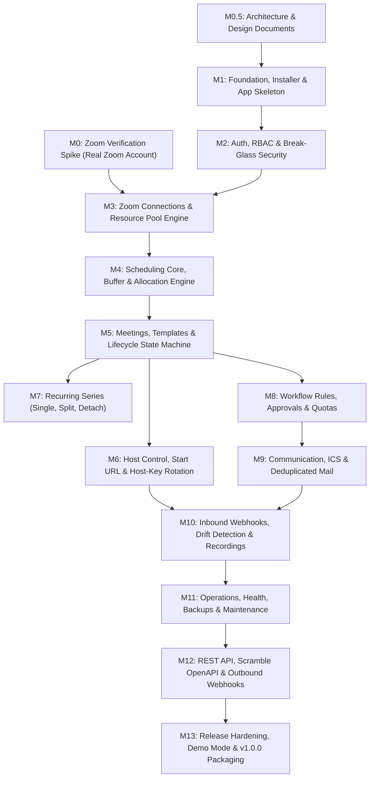

# Zoom Pool Manager (ZPM) — Master Implementation Plan

> **Tagline:** *Automate Your Zoom Resource Pool*  
> **Source Documents:** [`CLAUDE.md`](../CLAUDE.md), [`docs/SPEC.md`](SPEC.md), [`docs/zoom-verification.md`](zoom-verification.md)

---

## 1. Executive Summary & Scope

**Zoom Pool Manager (ZPM)** is an independent, single-organization web application designed to centrally manage a shared pool of licensed Zoom accounts (e.g., 20–30 licensed users in a university or corporate department) and dynamically allocate them to classes, meetings, and events.

### Core Architecture & Stack
- **Framework & Runtime:** PHP 8.3+, Laravel 12.x.
- **Database:** MySQL 8.0+ / MariaDB 10.6+ (utilizing `SKIP LOCKED` for high-throughput database queues).
- **Frontend:** Blade + Alpine.js (CSP-compliant build) + Tailwind CSS. Compiled at release; **no Node.js required in production**.
- **Queue & Scheduling:** Laravel Scheduler + Database queue driver (no mandatory Redis or Supervisor). Shared-hosting compliant pseudo-cron support.
- **Deployment Targets:** Shared hosting (cPanel/DirectAdmin/Plesk via zero-dependency pre-built ZIP with `.env` outside webroot), VPS (Nginx + PHP-FPM), and Docker Compose.
- **Testing:** Pest PHP, PHPStan / Larastan (Level 6+), Laravel Pint (PSR-12).

---

## 2. Non-Negotiable Operating Rules (from CLAUDE.md & SPEC Part A)

1. **No Stubs, No Placeholders, No Fake Zoom Behavior:** Every milestone must deliver working end-to-end functionality (migration → model → service → policy → controller → view → job → test → docs). If Zoom lacks an API or capability, document it in `docs/zoom-limitations.md`, implement the documented fallback, and flag an admin warning.
2. **M0 Verification Gate:** Zoom code can **only** use endpoints, fields, scopes, and webhook schemas verified in a real Zoom test account and marked `VERIFIED` in `docs/zoom-verification.md`. Currently, status is `NOT YET VERIFIED`. Non-Zoom code (M0.5 design docs, M1 foundation, M2 auth/RBAC) may be built prior to M0 completion.
3. **Single Organization Only:** Multi-tenancy is strictly forbidden. No `tenant_id` or `organization_id` columns on business tables.
4. **Domain Services for Logic:** Business logic lives in `app/Domain/<Module>`. Controllers validate (FormRequests), authorize (Policies), call Domain Services, and return responses.
5. **Asynchronous by Default:** All external HTTP calls (Zoom API, SSO sync, webhooks, emails) must run in queued jobs. Only authorized exceptions (connection test, immediate host launch redirect) are synchronous.
6. **Strict Verification on Completion:** Every milestone concludes with: `./vendor/bin/pint`, `./vendor/bin/phpstan analyse`, and Pest test suite execution passing 100%.

---

## 3. Environment & Prerequisites Notice

- **PHP Runtime:** The local host CLI currently has PHP 8.2.12 installed (`C:\xampp\php\php.exe`), whereas SPEC Part C mandates **PHP 8.3+**. Docker 29.6.1 is installed and available. We recommend running the Laravel 12 environment and test suites via Docker (using PHP 8.3 FPM / CLI container) or upgrading local PHP to 8.3+.

---

## 4. Master Milestone Roadmap (SPEC Part J)

---

### Phase 0: Discovery, Verification & Architecture

#### [Milestone M0] Zoom Verification Spike
- **Objective:** Run verification test suite in `tools/zoom-spike/` against a real Zoom test account with Server-to-Server OAuth.
- **Tasks:**
  - Verify S2S OAuth token generation, scopes returned, and token expiry.
  - Verify user list pagination (`GET /users`), license types, and feature add-ons (large meeting, webinar, cloud recording, AI companion).
  - Verify scheduled meeting creation (`POST /users/{id}/meetings`), updates, and deletions.
  - Verify type 8 fixed-time recurring meetings, occurrence limits (50 cap), and agenda marker `[ZPM:{id}]` persistence.
  - Verify JIT `start_url` retrieval and lifetime, host key retrieval and rotation via `PATCH /users/{id}`.
  - Verify webhook signature validation (`x-zm-signature` HMAC-SHA256) and challenge response `endpoint.url_validation`.
  - Save clean fixtures into `tests/Fixtures/Zoom/`.
  - Update `docs/zoom-verification.md`, fill `config/zpm-zoom-scopes.php`, and list unsupported features in `docs/zoom-limitations.md`.

#### [Milestone M0.5] Design Documents & Schemas
- **Objective:** Complete full architectural blueprints prior to application coding.
- **Deliverables:**
  - `docs/ARCHITECTURE.md`: High-level system architecture, module dependency map, queue/notification design, deployment models.
  - `docs/DATABASE.md` & ERD: Comprehensive table schemas (ULID public IDs, bigint auto-increment PKs, foreign keys, indexes).
  - `docs/permissions.md`: Complete role-permission matrix across all 9 roles and 20+ permissions.
  - `docs/decisions/`: ADRs for any technical choices outside the SPEC defaults.

---

### Phase 1: Core Foundation & Security

#### [Milestone M1] Foundation & Web Installer
- **Objective:** Laravel 12 skeleton configured for secure shared hosting and Docker.
- **Key Deliverables:**
  - Configurable `.env` location outside web root via `zpm-paths.php`.
  - Web installer wizard: Pre-flight checks (PHP extensions, HTTPS, web-root exposure test), DB setup & migrations, initial Super Admin creation with **mandatory TOTP enrollment**, org timezone and branding setup.
  - Installer lock mechanism (`zpm:installer:unlock` CLI override).
  - Docker Compose setup (`php-fpm 8.3`, `mariadb 10.6`, `caddy`/`nginx`).
  - GitHub Actions CI (Pint, PHPStan level 6+, Pest tests on PHP 8.3/8.4 and MySQL 8/MariaDB 10.6).

#### [Milestone M2] Authentication & RBAC
- **Objective:** Enterprise authentication, JIT provisioning, and audit logging.
- **Key Deliverables:**
  - Authentication drivers: Local login, Google OIDC, Microsoft Entra ID, SAML 2.0 (dual certificate rotation support).
  - Break-glass local Super Admin CLI (`php artisan zpm:admin:reset {email}`) and emergency access.
  - Spatie Permission implementation for 9 roles and department scoping.
  - Immutable audit log system (`hash = sha256(previous_hash + row_json)`).

---

### Phase 2: Zoom Integration & Allocation Engine

#### [Milestone M3] Zoom Connections & Resources (Unblocked after M0)
- **Objective:** Manage Zoom credentials, user synchronization, and resource pools.
- **Key Deliverables:**
  - Central `ZoomClient` with exponential backoff on HTTP 429, token caching with atomic locks (`Cache::lock`), and daily API counter tracking.
  - Connection manager with live scope validation diagnostic.
  - User sync job importing Zoom users into `zoom_users` and managed `zoom_resources`.
  - Resource pool configurations with strategy assignment (Round Robin, Least Hours, Least Meetings, Preferred, Random).

#### [Milestone M4] Scheduling Core & Allocation Engine
- **Objective:** Concurrency-safe, deadlock-free allocation of pooled resources.
- **Key Deliverables:**
  - `resource_reservations` occupancy table (source of truth covering `[starts_at, ends_at + buffer]`).
  - Allocation transaction: `SELECT ... FOR UPDATE` ordered by resource ID.
  - Effective policy resolver (`Org -> Security Profile -> Dept -> Role -> Template -> Request`).
  - Conflict preview engine (detects overlaps, buffer violations, blackout dates, capacity mismatches).
  - Automated tests asserting parallel race conditions cannot double-book resources.

#### [Milestone M5] Meeting Requests & Lifecycle
- **Objective:** End-to-end meeting lifecycle and UI views.
- **Key Deliverables:**
  - Booking request form with live availability preview.
  - Default templates (Faculty Class, Faculty Meeting, Student Meeting, Interview, Exam, Training, External Event, Confidential, Webinar).
  - Security profiles (enforcing passcode, waiting room, join before host, AI Companion policy).
  - Asynchronous meeting provisioning job with agenda marker idempotency (`[ZPM:{id}]`).
  - State machine with strict transitions (`draft -> pending_approval -> approved -> allocating -> scheduled -> started -> ended -> recording_processing -> completed`).
  - Views: Dashboard, My Meetings, Meeting Details, and Resource Timeline calendar.

---

### Phase 3: Host Operations & Workflow Governance

#### [Milestone M6] Host Control & Access Security
- **Objective:** Allow meeting organizers to host meetings without knowing Zoom account passwords.
- **Key Deliverables:**
  - JIT "Start Meeting" button: fetches fresh `start_url` at click time, audits, and redirects (never stored in DB or emailed).
  - Host key reveal modal for authorized users during active meeting window.
  - Automated host key rotation via Zoom API upon meeting conclusion.
  - Emergency IT host recovery flow with mandatory reason logging and notifications.

#### [Milestone M7] Recurring Series Management
- **Objective:** Advanced recurring series handling.
- **Key Deliverables:**
  - Series modes: `SINGLE_RESOURCE` (1 Zoom meeting, 1 join link), `SPLIT_WHEN_NEEDED` (segmented), `PER_OCCURRENCE`.
  - Occurrence editing and detachment (reallocating a single occurrence breaks it cleanly into a standalone meeting).
  - Join link protection policies (`BLOCK_AFTER_NOTIFICATION`, `NEW_LINK`, `PRESERVE_LINK`).
  - Holiday and blackout date auto-skipping.

#### [Milestone M8] Workflow Rules, Approvals & Quotas
- **Objective:** Automated governance, approval chains, and quota enforcement.
- **Key Deliverables:**
  - Rule engine evaluating meeting parameters (duration, participants, department, security profile).
  - Approval chains (ANY/ALL, multi-step, manager, IT) with anti-self-approval enforcement.
  - Delegation, reminder alerts, and auto-escalation/expiration.
  - Quotas (meetings/hours per user or department) and instant meeting support.
  - Basic FIFO waitlist.

---

### Phase 4: Communications, Integrations & Hardening

#### [Milestone M9] Communications & Notifications
- **Objective:** Deliver reliable transactional emails and ICS calendar files.
- **Key Deliverables:**
  - Mail providers: SMTP, Gmail API, Microsoft Graph `sendMail`.
  - DB-backed sanitized email templates with variable substitution.
  - Deduplicated queued delivery (`dedupe_key = event_id + recipient + template`).
  - ICS calendar invite generation (`spatie/icalendar-generator`) with stable UIDs and incremented sequence counters.
  - In-app notification center.

#### [Milestone M10] Webhooks, Drift Detection & Recordings
- **Objective:** Real-time event handling and bidirectional synchronization.
- **Key Deliverables:**
  - Inbound webhook handler (`POST /webhooks/zoom/{public_id}`) with HMAC validation and replay protection.
  - Drift reconciliation job comparing ZPM database state against Zoom API for the next 30 days.
  - Drift conflict resolution UI (Resolve, Accept Zoom, Ignore, Mark External).
  - Cloud recording metadata indexing mapped to logical meeting owner, with authorized playback redirects.

#### [Milestone M11] Operations, Health & Maintenance
- **Objective:** Enterprise maintenance, diagnostic, and observability tools.
- **Key Deliverables:**
  - System health monitor (`/admin/health`) inspecting DB, Queue, Zoom API, S2S Tokens, Webhooks, Storage, Disk.
  - Maintenance mode with bypass for admins (queue and webhooks continue processing to avoid drift).
  - Database backup management via `spatie/laravel-backup` with encryption and integrity verification.
  - Data retention cleanup jobs and GDPR/DPDP data export/anonymization workflows.

#### [Milestone M12] REST API & Outgoing Webhooks
- **Objective:** Programmatic integration layer.
- **Key Deliverables:**
  - `/api/v1` REST endpoints authenticated with scoped, hashed API keys.
  - Support for `Idempotency-Key` headers on POST requests.
  - Interactive OpenAPI documentation rendered via Scramble (`/docs/api`).
  - Outgoing signed webhooks with HMAC-SHA256 signatures and delivery retry queues.

#### [Milestone M13] Release Hardening, Demo Mode & V1.0.0
- **Objective:** Final quality audits, demo seeding, and release packaging.
- **Key Deliverables:**
  - Demo mode (`ZPM_DEMO=true`) with `FakeMeetingProvider`, seeded dummy pool, and nightly reset.
  - Accessibility audit (WCAG AA contrast, keyboard navigation, aria labels).
  - Packaging pipeline generating zero-dependency release ZIP with pre-built assets for shared hosting.
  - V1.0 Acceptance Checklist sign-off across shared hosting and Docker.

---

## 5. Owner Decision Registry (SPEC Part B)

The following defaults from SPEC Part B are applied unless overridden:

| Setting | Default Value | Status |
|---|---|---|
| **Software License** | Owner must decide before v1.0 (AGPL-3.0, Apache-2.0, or MIT). `LICENSE-PENDING.md` used until then. | Pending Owner Choice |
| **Organization Timezone** | `Asia/Kolkata` | Standard Default |
| **Default Meeting Buffer** | 10 minutes (Allowed range: 10–60 min) | Standard Default |
| **Minimum Booking Notice** | 2 hours | Standard Default |
| **Maximum Advance Booking**| 90 days | Standard Default |
| **Default Allocation Strategy** | Least hours (today) | Standard Default |
| **Recurring Series Mode** | `SINGLE_RESOURCE` (single Zoom recurring meeting) | Standard Default |
| **Join-Link Policy on Reallocation** | `BLOCK_AFTER_NOTIFICATION` | Standard Default |
| **Max Concurrent Meetings Per Resource** | 1 | Standard Default |
| **Default UI Language** | English (Tamil & Hindi via translation files) | Standard Default |

---

## 6. Immediate Next Steps

1. **Owner Confirmation:** Review this master implementation plan and confirm the immediate milestone to begin.
2. **Recommended Starting Point:**
   - **Milestone M0.5 (Design Documents & Architecture Blueprint):** Can be started immediately without a live Zoom account, creating `docs/ARCHITECTURE.md`, `docs/DATABASE.md`, and `docs/permissions.md`.
   - OR **Milestone M0 (Zoom Verification Spike):** If a Zoom test account with Server-to-Server OAuth credentials is ready, prepare the spike scripts in `tools/zoom-spike/`.
   - OR **Milestone M1 (Foundation & Installer):** Begin the Laravel 12 application foundation and installer.
