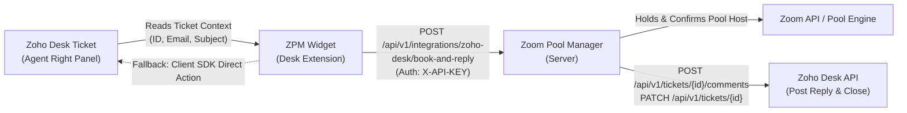

# Zoho Desk Integration & Extension

Schedule pooled Zoom meetings on behalf of ticket requesters directly from Zoho Desk and automatically post meeting credentials and links into the ticket.

---

## 🌟 Overview & Key Capabilities

The **Zoom Pool Manager (ZPM) Zoho Desk Extension** integrates your institutional Zoom license pools directly into the Zoho Desk agent interface (`desk.ticket.detail.rightpanel`).

When IT agents or helpdesk staff handle tickets requesting video conferencing support:
* **Book on Behalf Of:** The extension automatically detects the ticket requester's email and name, creating an account for them in ZPM (if they don't already exist) and assigning them as the meeting owner.
* **Auto-Reply & Post to Ticket:** Instantly generates the Zoom Join Link, Meeting ID, Passcode, and Host Key PIN, and posts them directly into the Zoho Desk ticket conversation as a public reply or internal note.
* **Auto-Close Ticket:** Optionally resolves or closes the ticket automatically upon successful booking.
* **Pool & Policy Governance:** Adheres to all institutional quota rules, capacity limits, host key rotation policies, and buffer windows.

---

## 🏗️ Architecture & Data Flow



1. **Ticket Intake:** When an agent opens a ticket in Zoho Desk, the widget accesses ticket context via the Zoho Desk Apps SDK (`id`, `ticketNumber`, `subject`, `contact.name`, `contact.email`).
2. **Allocation & Booking:** The agent clicks **Book Meeting & Update Ticket**. ZPM securely provisions the Zoom meeting on behalf of the ticket creator and rotates the host key.
3. **Comment & Status Execution:**
   - **Server-to-Server:** If Zoho Desk OAuth credentials or an Agent Token are configured in ZPM, ZPM directly calls Zoho Desk REST API v2 to add the ticket comment and mark it closed.
   - **Client-Side Fallback:** If server-side Zoho credentials are not configured, the extension widget executes the reply and status update directly via the agent's active browser session using the Zoho Desk JavaScript SDK.

---

## 🛠️ Step-by-Step Setup Guide

### Step 1: Download the Pre-Configured Extension Package

1. Sign in to Zoom Pool Manager as an **Administrator**.
2. Navigate to **Developer & Integrations** → **Zoho Desk Widget** (`/app/settings/zoho-desk`).
3. Click the **Download Extension (.zip)** button in the top action bar.
4. ZPM automatically generates `zoom-pool-manager-zoho-desk.zip` pre-bundled with your server URL (`https://your-domain.edu`) and active integration API token.

---

### Step 2: Upload the Extension to Zoho Desk

1. Sign in to your **Zoho Desk Portal** with administrative privileges.
2. Click the **Setup (Gear icon)** in the top navigation bar.
3. In the left navigation, scroll to **Developer Space** and click **Extensions** (or **Custom Apps**).
4. Click **Install Extension** or **Upload Custom Extension** in the top-right corner.
5. Choose the downloaded `zoom-pool-manager-zoho-desk.zip` file and click **Install**.
6. In the extension permissions window:
   * Set visibility to **All Agents** or your designated **IT Support** department.
   * Review the widget location: `desk.ticket.detail.rightpanel`.
7. Click **Save** to complete installation.

---

### Step 3: Configure Server-to-Server Credentials (Optional & Recommended)

To allow ZPM to post comments and update ticket statuses independently of the agent's browser session:

1. Visit the [Zoho Developer Console](https://api-console.zoho.com/) and create a **Server-based Application** or **Self Client**.
2. Generate the following OAuth scopes:
   * `Desk.tickets.READ`
   * `Desk.tickets.UPDATE`
   * `Desk.comments.CREATE`
   * `Desk.basic.READ`
3. In Zoom Pool Manager, go to **Zoho Desk Settings** (`/app/settings/zoho-desk`) and enter:
   * **Zoho Data Center (DC):** Select your region (`.in`, `.com`, `.eu`, `.com.au`, `.jp`, `.ca`, `.com.cn`).
   * **Portal / Organization ID:** Found in Zoho Desk *Setup → Organization Profile*.
   * **Client ID** & **Client Secret**
   * **Refresh Token** (or provide a direct **Desk Agent Token**).
4. Click **Test Connection** to confirm a successful handshake with the Zoho Desk API.
5. Click **Save Configuration**.

---

## 🧑‍💻 How IT Agents Use the Extension

When handling a support ticket in Zoho Desk:

1. Open any ticket.
2. On the right-hand panel, click the **Zoom Meeting** icon.
3. The widget displays the requester's name, email, and ticket subject.
4. Specify:
   * **Meeting Topic:** Prefilled with the ticket subject (editable).
   * **Date & Time:** Prefilled with the next available 30-minute time slot.
   * **Duration:** Select between 30 minutes, 1 hour, 2 hours, etc.
   * **Resource Pool:** Choose a specific pool (e.g. *Webinar 500* or *Campus General Pool*) or leave as automatic.
5. Review action toggles:
   * ☑️ **Post Meeting Details in Ticket:** Enabled by default.
   * **Reply Type:** Choose between **Public Reply** (sent to the ticket submitter) or **Private Comment** (internal note).
   * ☑️ **Close / Resolve Ticket after booking:** Automatically transitions ticket status to *Closed* or *Resolved*.
   * ☑️ **Include Host Key PIN for Claim Host:** Includes the 6-digit host PIN so the requester can claim host status in the Zoom client.
6. Click **Book Meeting & Update Ticket**.
7. The widget displays an instant confirmation card with 1-click copy buttons for the Join Link, Meeting ID, Passcode, and Host Key PIN.

---

## 📝 Ticket Comment Template & Placeholders

You can customize the message template posted to tickets in **Settings → Zoho Desk Integration** (`/app/settings/zoho-desk`).

### Available Placeholders

| Placeholder | Replaced Value | Example Output |
| :--- | :--- | :--- |
| `{requester_name}` | Name of the ticket requester | `Dr. Rajesh Sharma` |
| `{meeting_title}` | Topic / title of the meeting | `Faculty Committee Review` |
| `{starts_at}` | Start date and time | `2026-10-06 14:00` |
| `{ends_at}` | End date and time | `2026-10-06 15:00` |
| `{start_time}` | Formatted start time | `02:00 PM` |
| `{end_time}` | Formatted end time | `03:00 PM` |
| `{timezone}` | Configured timezone | `Asia/Kolkata` |
| `{duration_minutes}` | Duration in minutes | `60` |
| `{join_url}` | Zoom Join Meeting URL | `https://zoom.us/j/84920485918?pwd=...` |
| `{meeting_id}` | Zoom Meeting ID | `849 2048 5918` |
| `{passcode}` | Numerical meeting passcode | `842918` |
| `{host_key}` | 6-digit Host Key PIN | `654321` |
| `{host_key_section}` | Formatted claim host guidance | `🛡️ Host Key PIN: 654321 (Claim Host: Participants > Claim Host)` |
| `{ticket_number}` | Zoho Desk Ticket Number | `TKT-10492` |
| `{app_url}` | Zoom Pool Manager portal URL | `https://zoom.yourdomain.edu` |

### Default Template

```markdown
Hello {requester_name},

Your Zoom meeting has been scheduled via Zoom Pool Manager.

📅 **Topic:** {meeting_title}
🕒 **Date & Time:** {starts_at} - {ends_at} ({timezone})
⏱️ **Duration:** {duration_minutes} minutes

🔗 **Join Zoom Meeting:**
{join_url}

🆔 **Meeting ID:** {meeting_id}
🔑 **Passcode:** {passcode}
{host_key_section}

Please let us know if you need any additional assistance.
```

---

## 🔌 Integration API Reference

External services and custom widgets communicate with ZPM using the following endpoints:

### 1. Get Integration Options
```http
GET /api/v1/integrations/zoho-desk/options
Header: X-API-KEY: zpm_zd_your_api_token
```

**Response (200 OK):**
```json
{
  "success": true,
  "default_pool_id": 1,
  "default_template_id": null,
  "default_duration_minutes": 60,
  "default_is_public": true,
  "auto_close_ticket": true,
  "ticket_close_status": "Closed",
  "pools": [
    { "id": 1, "name": "Campus General Pool", "capacity": 300 }
  ],
  "templates": [],
  "comment_template": "...",
  "org_name": "University Zoom Pool Manager"
}
```

---

### 2. Book Meeting on Behalf & Reply
```http
POST /api/v1/integrations/zoho-desk/book-and-reply
Header: Content-Type: application/json
Header: X-API-KEY: zpm_zd_your_api_token

{
  "ticket_id": "90123",
  "ticket_number": "TKT-10492",
  "ticket_subject": "Need Zoom meeting with Dean",
  "ticket_email": "faculty@krea.edu.in",
  "ticket_contact_name": "Prof. Rajesh Sharma",
  "title": "Meeting with Dean",
  "starts_at": "2026-10-06T14:00:00+05:30",
  "duration_minutes": 60,
  "pool_id": 1,
  "post_to_ticket": true,
  "is_public": true,
  "close_ticket": true,
  "ticket_status": "Closed",
  "share_host_key": true
}
```

**Response (200 OK):**
```json
{
  "success": true,
  "meeting": {
    "id": 104,
    "public_id": "01JA6K7...",
    "title": "Meeting with Dean",
    "status": "scheduled",
    "starts_at": "2026-10-06T14:00:00+05:30",
    "ends_at": "2026-10-06T15:00:00+05:30",
    "timezone": "Asia/Kolkata",
    "zoom_meeting_id": "84920485918",
    "join_url": "https://zoom.us/j/84920485918?pwd=...",
    "passcode": "842918",
    "host_key": "654321",
    "owner": {
      "id": 42,
      "name": "Prof. Rajesh Sharma",
      "email": "faculty@krea.edu.in"
    }
  },
  "comment_text": "Hello Prof. Rajesh Sharma,\n\nYour Zoom meeting has been scheduled...",
  "ticket_comment_posted": true,
  "ticket_closed": true,
  "message": "Meeting successfully scheduled on behalf of ticket creator."
}
```

---

## ❓ Frequently Asked Questions (FAQ)

### What happens if the ticket creator doesn't have an account in ZPM?
ZPM automatically provisions an account for the user using their email and contact name from the Zoho Desk ticket and assigns them the default user role. When they sign in to ZPM via SSO or credentials, the meeting appears in their personal meeting dashboard.

### Can agents change the meeting duration or resource pool?
Yes. The extension right-panel widget provides dropdown selectors for meeting duration and specific resource pools (e.g. 300-seat, 500-seat, or 1000-seat pools).

### What happens if the server-to-server Zoho Desk OAuth credentials expire?
The extension widget includes a client-side SDK fallback. If the backend fails to reach Zoho Desk API, the widget automatically posts the comment and closes the ticket using the agent's current authenticated Zoho Desk browser session.

### How do agents find the extension in Zoho Desk?
Once installed, open any ticket in Zoho Desk. On the right-side utility panel (where Contact Info and History appear), click the **Zoom Meeting** tab to open the widget.
